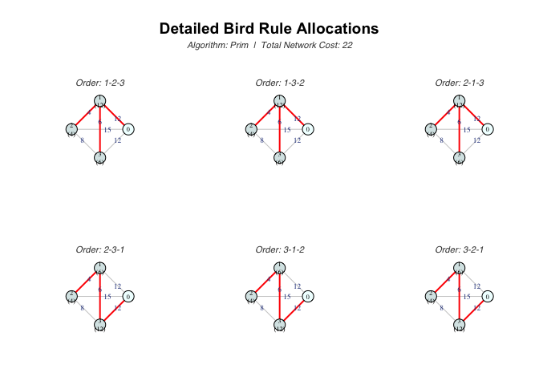
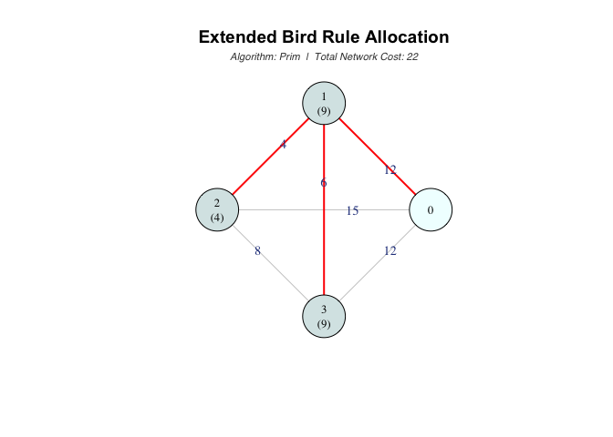
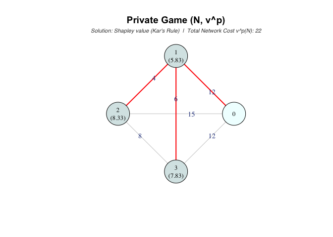

# mcstprules

<!-- badges: start -->
<!-- badges: end -->

The goal of `mcstprules` is to provide a comprehensive set of tools to
compute and visualize cost allocation rules for Minimum Cost Spanning
Tree Problems (MCSTP). The package implements two major approaches found
in the literature: algorithmic rules and rules defined through
cooperative games.

<br>

## Installation

You can install the development version of mcstprules from
[GitHub](https://github.com/) with:

``` r
# install.packages("pak")
pak::pak("luciasouto13/mcstprules")
```

<br>

## Features

The package organizes cost allocation rules into two main categories:

### Algorithmic Rules

These rules are derived directly from the network’s structure and
classic MST algorithms:

- Prim-based: `bird_rule` (Bird’ Rule) and `dk_rule` (Dutta-Kar).

- Kruskal-based: `folk_rule` (Folk Rule/ERO), `ows_rule` (Optimistic
  Weighted Shapley), and `pws_rule` (Pessimistic Weighted Shapley).

- Other approaches: `boruvka_rule` (Boruvka’s Rule) and `conewise_rule`
  (Cone-wise Decomposition).

### Cooperative Games

These rules compute the Shapley value of cooperative games associated
with the MCSTP:

- `private_game`: also known as the pessimistic game (Kar’s Rule).

- `irred_game`: based on the irreducible cost matrix.

- `opt_game`: optimistic game approach.

- `public_game`: connections through agents are publicly available.

- `cc_game`: based on the cycle-complete matrix.

<br>

## Examples

This basic examples show how to define a cost matrix (or its equivalent
lower triangular vector) and compute cost allocations for a 3-agent
problem (where node 0 is the source):

``` r
library(mcstprules)

# Define a cost matrix for 3 agents + source (node 0)
costs <- matrix(c(0, 12, 15, 12,
                 12,  0,  4,  6,
                 15,  4,  0,  8,
                 12,  6,  8,  0), nrow = 4, byrow = TRUE)
# Equivalent lower triangular vector without the diagonal
# costs <- c(12, 15, 12, 4, 6, 8)

# Algorithmic rules
bird_rule(costs)
#> Non-unique MCST detected
#>           1 2 3
#> B(id)    12 4 6
#> E[B(pi)]  9 4 9
folk_rule(costs)
#> 1 2 3 
#> 7 7 8

# Cooperative game theory rules
private_game(costs)
#>       S v^p(S)
#> 1   {1}     12
#> 2   {2}     15
#> 3   {3}     12
#> 4 {1,2}     16
#> 5 {1,3}     18
#> 6 {2,3}     20
#> 7     N     22
#> 
#> Solution: Shapley value
#>    1    2    3 
#> 5.83 8.33 7.83
public_game(costs)
#>       S v^u(S)
#> 1   {1}     12
#> 2   {2}     15
#> 3   {3}     12
#> 4 {1,2}     16
#> 5 {1,3}     18
#> 6 {2,3}     20
#> 7     N     22
#> 
#> Solution: Shapley value
#>    1    2    3 
#> 5.83 8.33 7.83
```

### Visualizing the problem

You can also visualize the network and the resulting allocation using
the built-in plotting capabilities (based on the `igraph` package):

``` r
# Example plot for Bird's Rule
bird <- bird_rule(costs, draw = TRUE)
```



``` r
# Example plot for Private Game (Kar's rule)
kar <- private_game(costs, draw = TRUE)
```



## Documentation

You can also download the [full PDF documentation
here](mcstprules_0.1.0.pdf).
